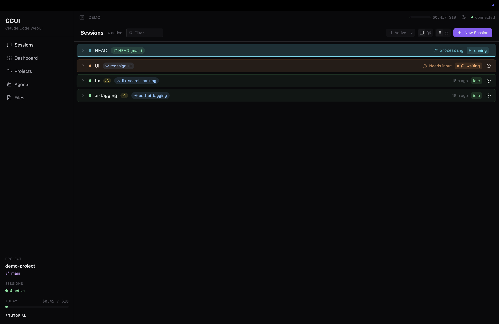
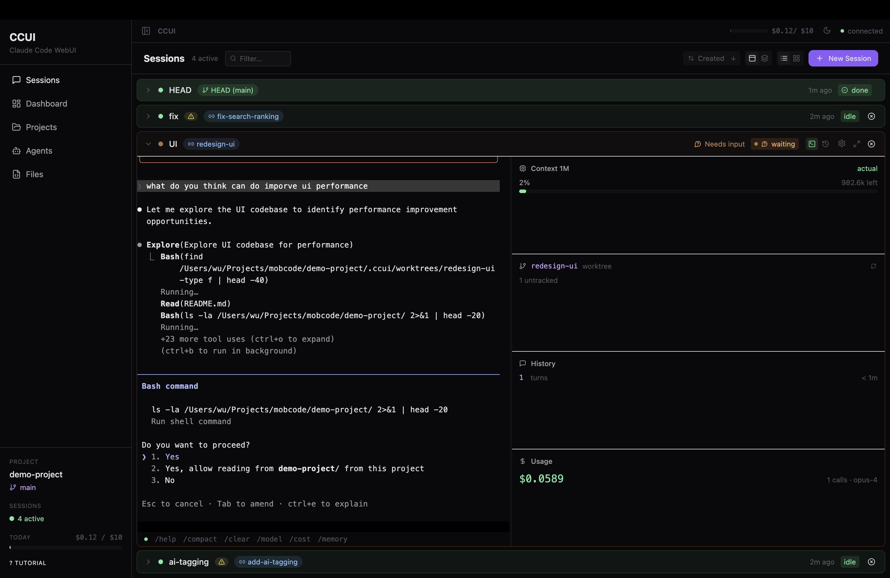
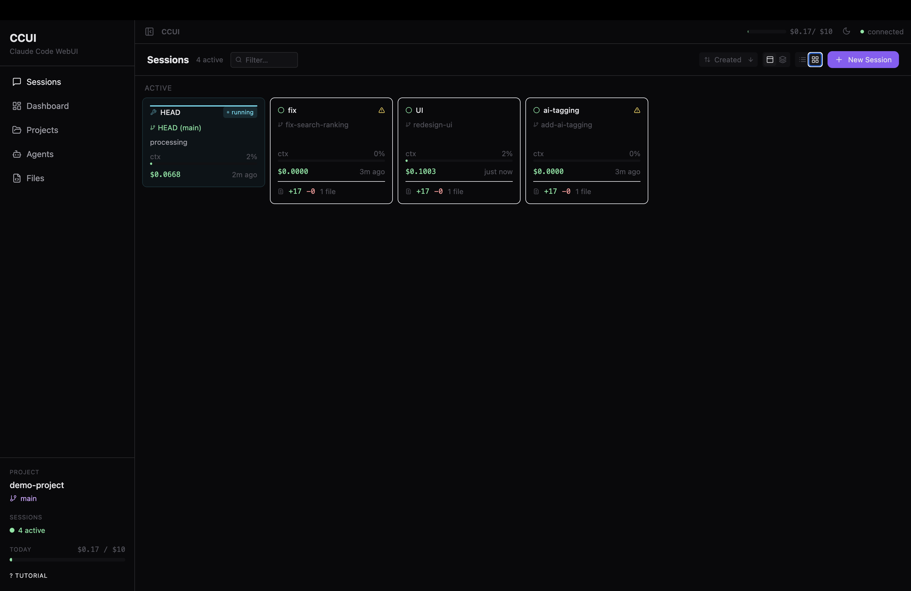
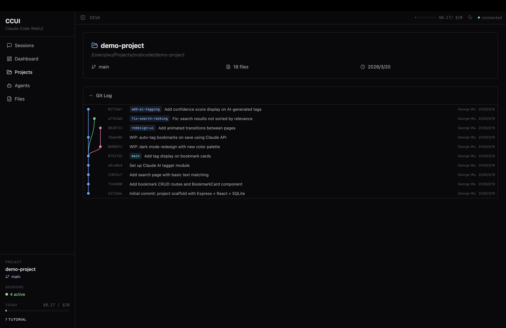
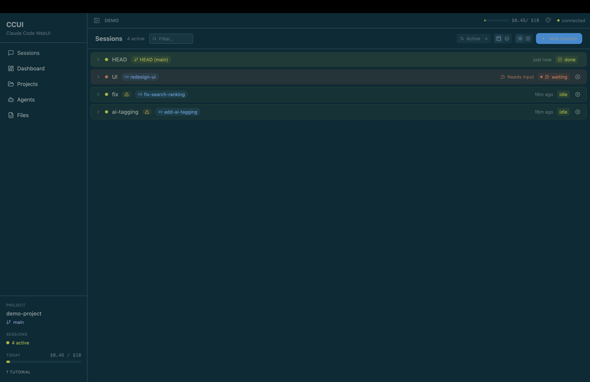
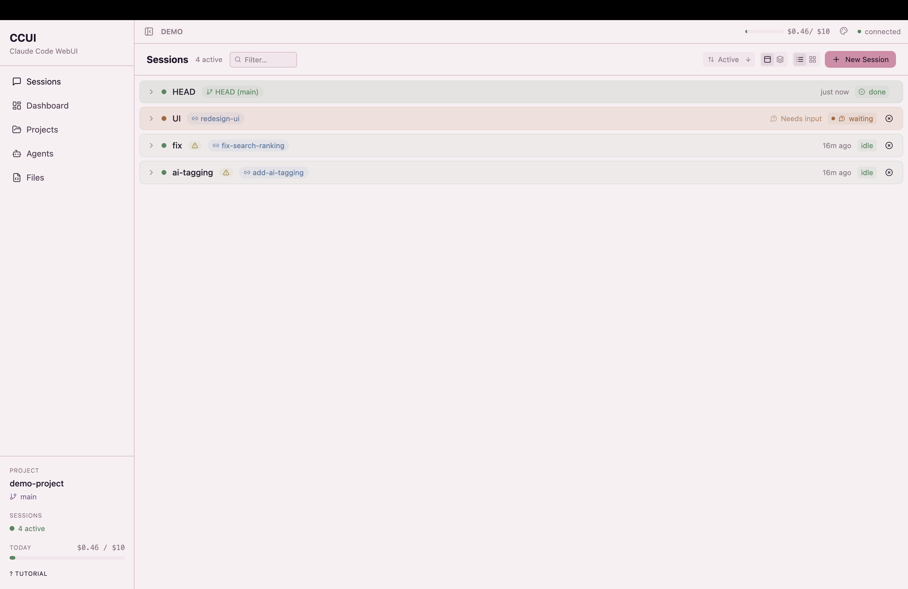

<div align="center">

<br/>
<br/>

<picture>
  <source media="(prefers-color-scheme: dark)" srcset="https://img.shields.io/badge/%E2%9A%A1-CCUI-black?style=for-the-badge&labelColor=000&color=7c3aed&logo=data:image/svg+xml;base64,PHN2ZyB4bWxucz0iaHR0cDovL3d3dy53My5vcmcvMjAwMC9zdmciIHdpZHRoPSIyNCIgaGVpZ2h0PSIyNCIgdmlld0JveD0iMCAwIDI0IDI0IiBmaWxsPSJub25lIiBzdHJva2U9IndoaXRlIiBzdHJva2Utd2lkdGg9IjIiPjxwYXRoIGQ9Ik0xMyAyTDMgMTRoOWwtLTEgMTAgMTAtMTJoLTlsMSAtMTB6Ii8+PC9zdmc+">
  
</picture>

# Claude Code WebUI

<br/>

```
  One codebase. Multiple Claude agents. Each on its own branch.
```

<br/>

<a href="#-quick-start"></a>
<a href="#-features"></a>
<a href="#-how-it-works"></a>

<br/>
<br/>


<br/>



<br/>

</div>

<br/>

## 🚀 Quick Start

> **You need:** Node.js 18+, [pnpm](https://pnpm.io/), [Claude Code CLI](https://docs.anthropic.com/en/docs/claude-code) authenticated.

```bash
git clone https://github.com/yxwucq/CCUI.git
cd CCUI
pnpm install && pnpm build
pnpm link --global # link to $PATH
```

Then point it at any project:

```bash
ccui                    # current directory
ccui --path ~/my-app    # specific project
ccui --port 8080        # custom port
```

<details>
<summary>All CLI options</summary>

```
--port <n>       Server port              default: 3456
--host <addr>    Bind address             default: localhost
--path <dir>     Project directory         default: cwd
--no-open        Don't auto-open browser
-v, --version    Version
-h, --help       Help
```

</details>

<br/>

## 💡 What is CCUI?

A web dashboard for [Claude Code](https://docs.anthropic.com/en/docs/claude-code) that enables **multi-worktree parallel development**. Each session runs a real Claude Code CLI in an isolated git worktree on its own branch — fix a bug, add a feature, and refactor a module simultaneously from a single browser tab.

<div align="center">



*Full interactive terminal with live activity tracking, context panel, and usage stats*

<br/>



*Grid view — cost, diff stats, and branch info per session*

</div>

<br/>

## Features

- **Parallel sessions** — spawn multiple Claude Code processes, each in its own xterm.js terminal
- **Git worktree isolation** — each session forks a new branch + worktree, merge or discard when done
- **Attach mode** — connect to an existing branch without forking
- **Live status** — see which sessions are running, waiting for input, or idle
- **File browser** — browse and diff files across worktrees
- **Cost tracking** — per-session token usage with daily budget alerts
- **Custom agents** — define system prompts and tool permissions
- **8 themes** — Dark, Light, Nord, Dracula, Catppuccin, Solarized, Tokyo Night, Sakura
- **100% local** — all data stays in `.ccui/` inside your project

## How It Works

Each session spawns a `claude` CLI process attached to a real PTY. Sessions can run in two modes:

- **Fork** — creates a new branch + git worktree from any base. Claude works in complete isolation. When done, merge back or discard.
- **Attach** — connects to an existing branch directly. Good for continuing work on a feature branch.

<div align="center">

</div>

<br/>

## 🎨 Themes

<div align="center">

 

`Dark` · `Light` · `Nord` · `Dracula` · `Catppuccin` · `Solarized` · `Tokyo Night` · `Sakura`

</div>

<br/>

## 📄 License

MIT

---

<div align="center">

<br/>

**Built for developers who think one Claude isn't enough.**

[](https://github.com/yxwucq/CCUI)

<br/>

</div>
